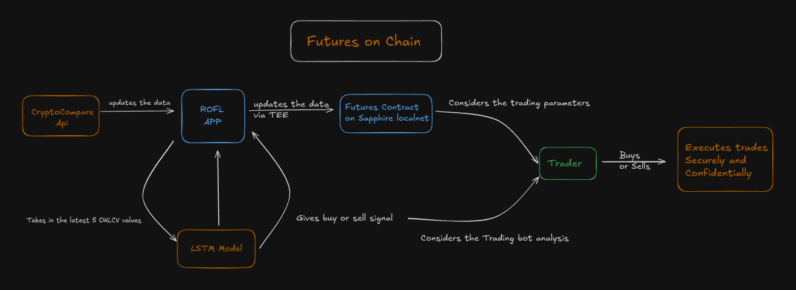
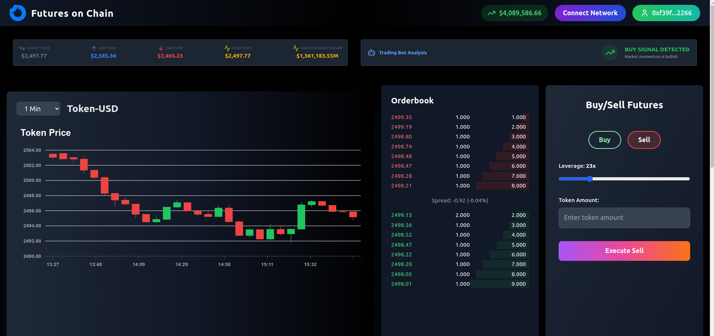
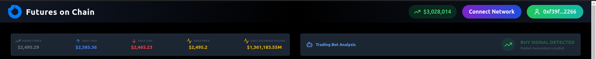
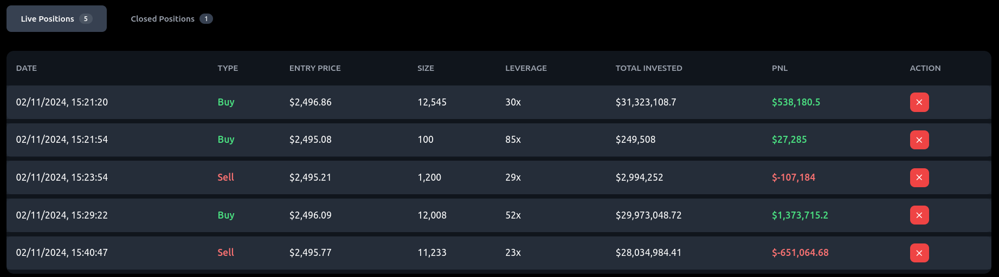
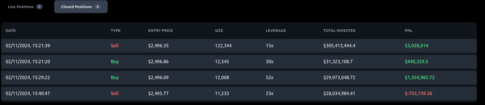

# Futures on Chain: A Secure and Confidential On-Chain Futures Trading Platform

This project introduces an innovative on-chain futures trading solution built on the Oasis Sapphire blockchain and using ROFL (Runtime OffChain Logic). This combination creates a secure, confidential, and tamper-proof trading environment. Traders can engage in futures contracts for a custom ERC-20 token, which dynamically mirrors a real-world currency like ETH. Through real-time price updates, a machine-learning-powered trading bot, and privacy-preserving execution, this platform enables reliable trading experiences, balancing both data security and transparency.

Video explaination: https://youtu.be/nJHYSz8WUD0

# System Design

<p align="center">
  
</p>

## Inspiration

The inspiration behind *Futures on Chain* was the desire to create a truly secure and private trading environment, addressing the limitations of traditional platforms and generic blockchain-based exchanges. Our team was motivated by the potential of the Oasis Sapphire blockchain’s TEEs (Trusted Execution Environments) and ROFL (Runtime OffChain Logic) to provide both confidentiality and reliability. This inspired us to explore the boundaries of on-chain futures trading, focusing on creating a platform where users could engage in privacy-preserving, tamper-proof transactions with real-time price feeds and predictive AI insights. This project is a step towards the next evolution of trading platforms, where security and privacy empower users without compromising transparency or functionality.

## Key Features

### 1. On-Chain Futures Trading

- **Capability**: Users can execute futures contracts on-chain for a custom ERC-20 token, pegged to a real-world currency.
- **Transparency**: The platform handles gains and losses by adjusting the trader's balance, enabling transparent and auditable on-chain transactions.
<p align="center">
  
</p>

### 2. Simulated Price Fluctuations with Tamper-Proof Oracle Integration

- **External Price Linkage**: The ERC-20 token's value reflects live market prices through ROFL, simulating real-time conditions.
- **Tamper-Resistance**: ROFL ensures securely fetched and unmanipulated price updates, empowering traders to make informed futures decisions with trustworthy data.

### 3. AI-Powered Trading Bot with LSTM Model for Market Predictions

- **Predictive Modeling**: A trading bot powered by an LSTM (Long Short-Term Memory) model analyzes historical data and suggests “Buy,” “Strongly Buy,” “Sell,” or “Strongly Sell” actions.
- **Data-Driven Insights**: This recommendation engine, combined with ROFL's trusted data, provides strategic market insights for traders.

<p align="center">
  
</p>

### 4. Automated Profit and Loss Management

- **Profit Management**: In profitable trades, the platform mints new tokens for payout, allowing traders to realize their gains instantly.
- **Loss Management**: For losses, the platform deducts the trader's posted collateral, ensuring fair trade handling and funds availability.
<p align="center">
  
</p>

### 5. Privacy-Preserving Execution with Trusted Execution Environments (TEEs)

- **Confidentiality**: Using Oasis’s Sapphire blockchain and TEEs, trade activities remain private while ensuring on-chain verification.
- **Security and Transparency**: TEEs allow secure, auditable trade execution without compromising trader data confidentiality.

### 6. Trade History and Performance Tracking

- **Comprehensive Record Keeping**: Traders can access transaction history and performance metrics directly through their wallets.
- **Immutable Storage**: On-chain storage of trade records ensures data reliability and helps traders optimize strategies over time.
<p align="center">
  
</p>

## Challenges Faced

- **ROFL Setup and Integration**: Due to ROFL's recent development, documentation was limited, making it difficult to set up locally for testing. Extensive research, alongside engagement with the Oasis community on Discord, helped us overcome these hurdles. After much trial and error, we successfully configured ROFL to securely interface with our contract.

- **Incorporating LSTM AI Model**: Originally, our project idea was a straightforward on-chain futures platform. However, we felt it lacked a unique factor. Introducing an LSTM model added value by providing market predictions, although we faced a steep learning curve with AI integration. Despite our limited experience with machine learning, we implemented a functional, though basic, LSTM model to deliver insights, with customizable features for future model enhancements.

- **Trading Chart Implementation**: It Is challenging to find a good library in react form making candle stick chart then we come to know about react-apexchart.Optimizing the rendering of large datasets in trading charts while maintaining smooth user interactions and preventing browser performance issues.

## How We Did It:

1. **Contract Development**: The main contract, located at `rofl-oracle/oracle/Oracle.sol`, integrates core trading functionalities with Oasis Sapphire's ROFL setup. By using `Subcall` from the `@oasisprotocol/sapphire-contracts`, we ensured a seamless interaction between the trading logic and the ROFL environment for accurate data processing and pricing.

2. **Backend Iterations**:  The many iterations of the backend createion and the logic behind it can easily be seen located at the rofl-oracle/oracle/src/tasks.ts where all the main logic and trades can be done via the CLI without launching the React app for a eassier testing environment.

3. **Inital thoughts**:  Some of the initial thought process before actual coding can be seen inside this [document](https://docs.google.com/document/d/1ndppAQ9Bw1pJCQWeqqeCvgDKp47SA6NQV-KNDlo0Jfc/edit?usp=sharing)

## How to Add Your Own Trading Bot

If you'd like to add a custom trading bot, follow these steps:

1. **Replace the LSTM Model**: In the current setup, `rofl-oracle/Lstm model/training.py` trains a basic LSTM model and generates a `model.tflite` file. To use a different model, modify `training.py` with your preferred algorithm, train the model, and save it as `model.tflite`.

2. **Adapt the ROFL App**: Depending on the structure of your new model, you may need to adjust `rofl-oracle/src/main.rs` to account for different inputs and outputs. This might include altering the input format for the latest OHLCV (Open, High, Low, Close, Volume) signals based on your data source, such as CryptoCompare or any other API of your choice.

3. **Deploy and Test**: Once configured, deploy the updated ROFL app within the Oasis Sapphire environment to test the bot's performance in predicting market trends and generating signals.

## Why ROFL?

ROFL is essential to the platform’s success due to its tamper-resistant price data capabilities:

- **Data Integrity**: Ensures price data authenticity, guarding against manipulation and fraud in decentralized environments.
- **AI Integration**: Supports the LSTM-based trading bot, providing reliable price trend predictions based on secure data feeds, essential for a trustworthy trading experience.

## Why Oasis Sapphire?

Oasis Sapphire offers privacy and scalability ideal for a futures trading platform:

- **Privacy**: Trusted Execution Environments (TEEs) on Sapphire keep sensitive trading data confidential.
- **Scalability**: Low latency and high transaction handling support efficient trading, even under heavy load.
- **Reliability**: Sapphire’s security ensures that the platform remains robust, making it an ideal choice for this privacy-focused, on-chain trading solution.

# Local Setup

This guide provides a step-by-step setup procedure to deploy and test a Futures dApp on the Oasis Sapphire local network using ROFL. **Note**: SGX-related requirements are excluded for this local testing setup.

---

## Step 1: Start the Localnet with ROFL

1. **Ensure Prerequisites**: Complete all ROFL prerequisites except for SGX-related ones.
2. **Build the Oracle**: Navigate to `rofl-oracle/` and build the oracle:

```bash
 oasis rofl build sgx --mode unsafe
```

> If the build fails, try updating Cargo:

```bash
 cargo update
```

3. **Start the Sapphire Localnet**: From the base git directory, run the following command to launch the Sapphire local network with ROFL:

```bash
 sudo docker run -it -p8545:8545 -p8546:8546 -v ./rofl-oracle:/rofls ghcr.io/oasisprotocol/sapphire-localnet
```

---

## Step 2: Deploy the Contract and Obtain Test Currency

4. **Navigate to the `rofl-oracle` Directory**: In a new terminal, move to the oracle directory to deploy the updated Futures contract:

```bash
 cd rofl-oracle/oracle
```

5. **Install Dependencies**: Run the following to install required packages:

```bash
 npm install
```

6. **Compile the ROFL Contract**:

```bash
 npx hardhat compile
```

7. **Deploy the Futures Contract**: Set up your private key and deploy the Futures contract on the Sapphire localnet:

```bash
 export PRIVATE_KEY=0xac0974bec39a17e36ba4a6b4d238ff944bacb478cbed5efcae784d7bf4f2ff80
 npx hardhat deploy rofl1qqn9xndja7e2pnxhttktmecvwzz0yqwxsquqyxdf --network sapphire-localnet
```

8. **Transfer Test Currency**: Fund your MetaMask account with test native currency and ERC-20 tokens:

```bash
 npx hardhat transfer-native-token --account <your_metamask_testing_account> --amount 100
 npx hardhat mint --account <your_metamask_testing_account>
```

---

## Step 3: Deploy and Interact with the Futures dApp

9. **Start the Client**: From the base directory, navigate to the client directory and start the app:

```bash
 npm run dev
```

Open the app in your browser at the localhost URL provided.

10. **Configure MetaMask**:
    - Add the Sapphire local testnet using the **Add Network** button on the upper right corner.
    - Connect your MetaMask wallet by selecting **Connect**.

---

With these steps, you’re ready to interact with your Futures on Chain dApp on the Oasis Sapphire local network!